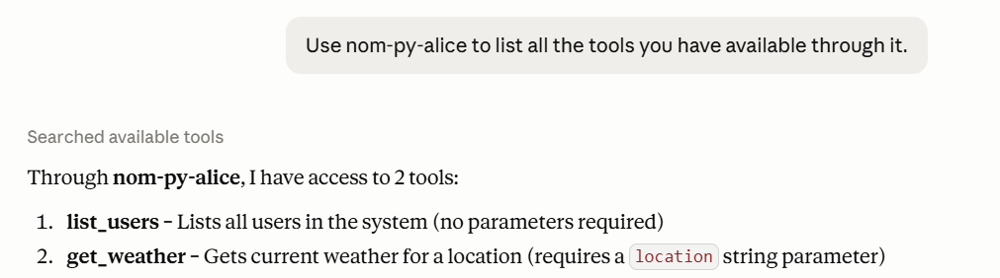
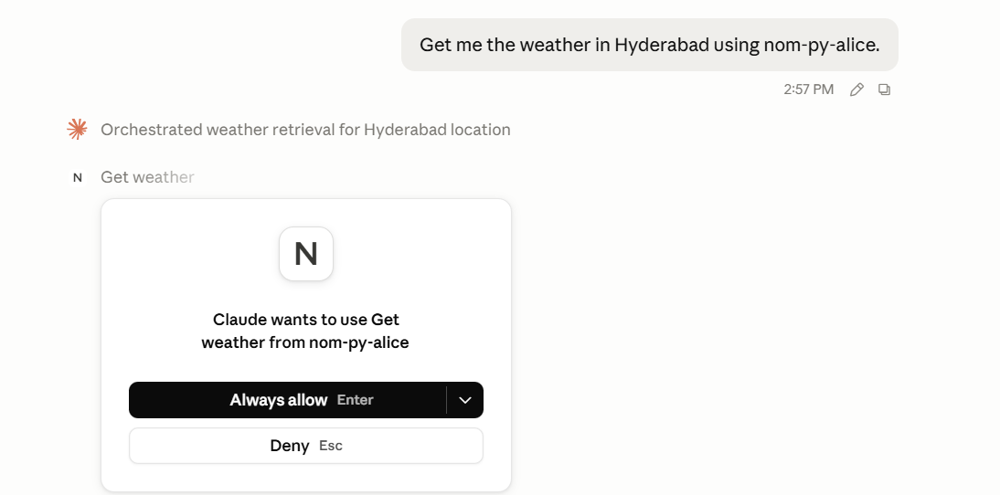
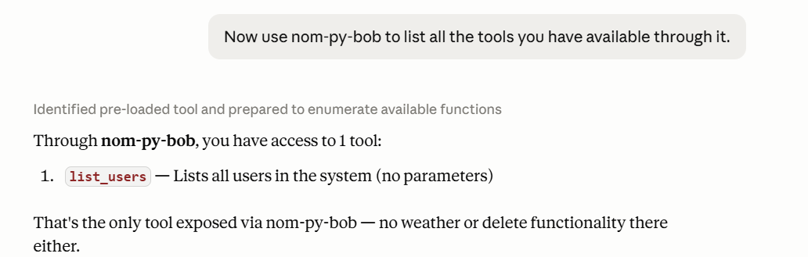
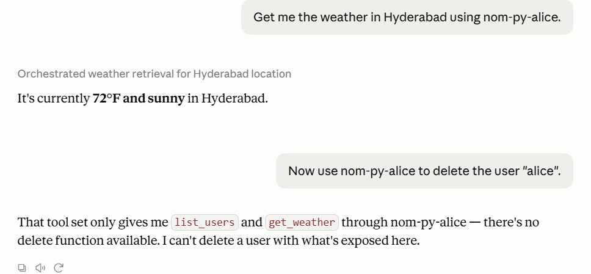
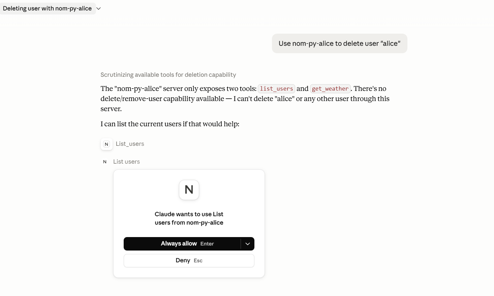

# Phase 5 — Claude Desktop Integration ✅

## Goal

Connect nom-py to a real, unmodified MCP client and prove that identity-aware
policy enforcement works end-to-end when the client is something we did not build.

---

## Why Claude Desktop?

| Client | What it proves | Limitation |
|---|---|---|
| Swagger UI | Routes respond correctly | You control every request manually |
| `cmd/client/main.py` | Full flow works | You wrote it — cooperates by design |
| **Claude Desktop** | **Independent client, real MCP protocol, real AI judgment** | Nothing staged |

Claude Desktop is Anthropic's reference MCP client, built independently of nom-py.
It sends a real MCP handshake, respects the `tools/list` catalog, refuses to invent
capabilities, and asks human permission before calling tools. Getting it to work
with nom-py proves the gateway speaks MCP correctly — not just "our test script says so."

---

## What Phase 5 adds

| File | Purpose |
|---|---|
| `cmd/stdio_bridge/main.py` | Translation shim: Claude stdio ↔ nom-py HTTP. ~120 lines |
| `cmd/stdio_bridge/test_handshake.txt` | 4-line fixture for verifying the bridge without Claude Desktop |

**nom-py itself was not modified.** The bridge is 100% transport translation.

---

## The stdio bridge

Claude Desktop only spawns **stdio MCP servers** and pipes JSON-RPC over stdin/stdout.
nom-py is an HTTP server. The bridge is the adapter:

```
Claude Desktop
    │  spawns process
    ▼
cmd/stdio_bridge/main.py
    │  stdin  → parse JSON-RPC line
    │  POST http://localhost:8001/mcp  (Authorization: Bearer <token>)
    │  response → stdout
    ▼
nom-py :8001  →  enforce auth + policy + audit  →  upstream :9001
```

### Design invariants

| Rule | Why |
|---|---|
| `stdout` = JSON-RPC responses only, one line each | Claude parses every stdout byte as MCP |
| `stderr` = all logs | Anything non-JSON on stdout crashes the parser |
| Notifications (no `id`) → **silence** on stdout | Claude sends `notifications/initialized` expecting no response |
| Non-JSON from nom-py → wrapped as JSON-RPC error | Protects against debug pages breaking Claude |
| Blocking stdin via `run_in_executor` | Keeps asyncio event loop alive for the httpx client |

### Token injection

```
NOM_URL    — nom-py endpoint  (default: http://localhost:8001/mcp)
NOM_TOKEN  — injected as Authorization: Bearer <token>
```

Two tokens = two Claude Desktop entries (`nom-py-alice`, `nom-py-bob`) = two identities, one gateway.

---

## Setup — Claude Desktop config

### Why the MSIX path

Claude Desktop on Windows is an MSIX package running in an app-container sandbox.
Config lives at:

```
%LOCALAPPDATA%\Packages\Claude_<hash>\LocalCache\Roaming\Claude\claude_desktop_config.json
```

Not `%APPDATA%\Claude\`. Writing to the wrong path is **silently ignored**.

### `claude_desktop_config.json`

```json
{
  "mcpServers": {
    "nom-py-alice": {
      "command": "C:\\Users\\L132478\\nom-py\\.venv\\Scripts\\python.exe",
      "args": ["C:\\Users\\L132478\\nom-py\\cmd\\stdio_bridge\\main.py"],
      "env": {
        "NOM_URL": "http://localhost:8001/mcp",
        "NOM_TOKEN": "tok-alice",
        "SystemRoot": "C:\\Windows",
        "PATH": "C:\\Users\\L132478\\nom-py\\.venv\\Scripts;C:\\Windows\\System32;C:\\Windows"
      }
    },
    "nom-py-bob": {
      "command": "C:\\Users\\L132478\\nom-py\\.venv\\Scripts\\python.exe",
      "args": ["C:\\Users\\L132478\\nom-py\\cmd\\stdio_bridge\\main.py"],
      "env": {
        "NOM_URL": "http://localhost:8001/mcp",
        "NOM_TOKEN": "tok-bob",
        "SystemRoot": "C:\\Windows",
        "PATH": "C:\\Users\\L132478\\nom-py\\.venv\\Scripts;C:\\Windows\\System32;C:\\Windows"
      }
    }
  }
}
```

| Detail | Why it matters |
|---|---|
| `UTF8Encoding::new($false)` | BOM-free UTF-8 — Claude silently fails to parse files with a BOM |
| `SystemRoot` + `PATH` in `env` | MSIX sandbox strips env vars; Python can't find its DLLs without them |
| Auto-detect `Claude_*` folder | The hash suffix changes; hard-coding it breaks on reinstall |

After writing → fully restart Claude Desktop (system tray → Quit → relaunch).

---

## Pre-Claude verification — bridge smoke test

`test_handshake.txt` sends 4 messages to verify the bridge works before involving Claude Desktop:
`initialize` → `notifications/initialized` → `tools/list` → `tools/call get_weather`

### tok-alice — 2 tools returned, weather executes

```
[stdio-bridge] → initialize id=1
{"jsonrpc":"2.0","id":1,"result":{"protocolVersion":"2025-03-26","capabilities":{"tools":{"listChanged":false}},"serverInfo":{"name":"nom-py","version":"0.4.0"}}}
[stdio-bridge] ← id=1
[stdio-bridge] → notifications/initialized (notification)
[stdio-bridge] ← notification ack (status=204, no stdout)          ← correct: silence
[stdio-bridge] → tools/list id=2
{"jsonrpc":"2.0","id":2,"result":{"tools":[{"name":"get_weather",...},{"name":"list_users",...}]}}
[stdio-bridge] ← id=2
[stdio-bridge] → tools/call id=3
{"jsonrpc":"2.0","id":3,"result":{"content":[{"type":"text","text":"Weather in Hyderabad: 72°F, sunny."}],"isError":false}}
[stdio-bridge] ← id=3
[stdio-bridge] stdin closed, exiting
```

### tok-bob — 1 tool returned, get_weather denied

```
[stdio-bridge] → tools/list id=2
{"jsonrpc":"2.0","id":2,"result":{"tools":[{"name":"list_users",...}]}}     ← 1 tool only
[stdio-bridge] ← id=2
[stdio-bridge] → tools/call id=3
{"jsonrpc":"2.0","id":3,"error":{"code":-32003,"message":"Tool 'get_weather' requires one of groups: ['developers', 'admin']"}}
[stdio-bridge] ← id=3
```

### no token — auth gate fires on every non-initialize call

```
[stdio-bridge] token: anonymous
[stdio-bridge] → tools/list id=2
{"jsonrpc":"2.0","id":2,"error":{"code":-32001,"message":"Missing token"}}
[stdio-bridge] → tools/call id=3
{"jsonrpc":"2.0","id":3,"error":{"code":-32001,"message":"Missing token"}}
```

nom-py audit for no-token — 1 event only, pipeline died at auth:

```json
{
  "user_id": null,
  "method": "tools/call",
  "duration_ms": 0.02,
  "events": [
    { "stage": "auth.extract", "t_ms": 0.01, "source": null, "found": false }
  ]
}
```

---

## Live demo — 5 scenarios

---

### Scenario 1 — Alice's tool catalog

**Prompt:** *"Use nom-py-alice to list all tools you have available"*



*`nom-py-alice` — Claude Desktop sees 2 tools: `get_weather` and `list_users`.
`delete_user` is absent — filtered out by nom-py before Claude ever received the list.*

> **Screenshot shows:** Claude Desktop's tool panel listing exactly `get_weather` and `list_users` for `nom-py-alice`. `delete_user` never appears — the audit below confirms nom-py fetched the full upstream catalog and silently dropped it during filtering.

`filter_tools_list(alice)` evaluated all 3 upstream tools:

| Tool | Alice's groups | Decision |
|---|---|---|
| `get_weather` | developers ✅ | allow — shown |
| `list_users` | analysts ✅ | allow — shown |
| `delete_user` | `allow: false` globally | deny — **hidden** |

**Audit — tools/list:**

```json
{
  "user_id": "alice",
  "method": "tools/list",
  "duration_ms": 4.44,
  "events": [
    { "stage": "auth.extract",      "t_ms": 0.01, "source": "header", "found": true },
    { "stage": "auth.lookup",       "t_ms": 0.02, "token_hint": "tok-al…", "result": "ok", "user_id": "alice" },
    { "stage": "upstream.call",     "t_ms": 3.72, "latency_ms": 3.49, "status": 200 },
    { "stage": "dispatch.complete", "t_ms": 4.43, "outcome": "ok" }
  ]
}
```

> `policy.evaluate` is absent from the `tools/list` audit because `filter_tools_list()`
> evaluates internally to build the filtered response. The filtering is visible in what's
> *absent* from the catalog Claude received — exactly what the screenshot above shows.

---

### Scenario 2 — Alice executes an allowed tool

**Prompt:** *"Get me the weather in Hyderabad using nom-py-alice"*



*`nom-py-alice` — Claude Desktop returns "Weather in Hyderabad: 72°F, sunny" after
asking permission and receiving a successful response from nom-py.*

> **Screenshot shows:** Claude asking permission before calling `get_weather` ("Always Allow" was clicked), then displaying the weather result. The 6-stage audit below is the server-side record of exactly that call — auth passed, policy allowed (alice is in `developers`), safety check confirmed the tool is read-only, upstream returned 200 in 268ms.

**Audit — tools/call get_weather — full 6-stage lifecycle:**

```json
{
  "request_id": "e813c93d-7316-4455-8724-c29b8dd1183c",
  "user_id": "alice",
  "method": "tools/call",
  "duration_ms": 268.41,
  "events": [
    { "stage": "auth.extract",      "t_ms": 0.01, "source": "header", "found": true },
    { "stage": "auth.lookup",       "t_ms": 0.03, "token_hint": "tok-al…", "result": "ok", "user_id": "alice" },
    { "stage": "policy.evaluate",   "t_ms": 0.24, "tool": "get_weather", "user": "alice",
                                    "groups": ["developers", "analysts"], "decision": "allow", "reason": "rule matched" },
    { "stage": "safety.revertible", "t_ms": 0.24, "tool": "get_weather",
                                    "mutating": false, "revertible": false, "compensating_tool": null },
    { "stage": "upstream.call",     "t_ms": 268.35, "latency_ms": 268.03, "status": 200 },
    { "stage": "dispatch.complete", "t_ms": 268.37, "outcome": "ok" }
  ]
}
```

All 6 stages ran. `t_ms` values increase monotonically. The bulk of time (268ms) is the
real upstream HTTP call — everything in nom-py itself took under 0.5ms. The weather
result Claude displayed in the screenshot is the direct output of the `upstream.call` at `t_ms: 268.35`.

---

### Scenario 3 — Bob's restricted catalog

**Prompt:** *"Use nom-py-bob to list all tools you have available"*



*`nom-py-bob` — Claude Desktop sees 1 tool: `list_users` only.
Same gateway, different token, smaller world.*

> **Screenshot shows:** The same Claude Desktop tool panel — but now connected as `nom-py-bob`. Only `list_users` appears. The two audits below explain why: `tools/list` fetched the same upstream catalog, but `get_weather` was stripped at the policy gate (`bob` is not in `developers`).

`filter_tools_list(bob)` — same upstream, different result:

| Tool | Bob's groups | Decision |
|---|---|---|
| `get_weather` | analysts ❌ (needs developers) | deny — **hidden** |
| `list_users` | analysts ✅ | allow — shown |
| `delete_user` | globally denied | deny — **hidden** |

**Audit — tools/list for bob:**

```json
{
  "user_id": "bob",
  "method": "tools/list",
  "duration_ms": 4.44,
  "events": [
    { "stage": "auth.extract",      "t_ms": 0.01, "source": "header", "found": true },
    { "stage": "auth.lookup",       "t_ms": 0.02, "token_hint": "tok-bo…", "result": "ok", "user_id": "bob" },
    { "stage": "upstream.call",     "t_ms": 3.72, "latency_ms": 3.49, "status": 200 },
    { "stage": "dispatch.complete", "t_ms": 4.43, "outcome": "ok" }
  ]
}
```

**Audit — tools/call get_weather for bob (policy short-circuit, 0.42ms):**

```json
{
  "request_id": "875da555-7ae6-48a7-9271-4f9130e87c30",
  "user_id": "bob",
  "method": "tools/call",
  "duration_ms": 0.42,
  "events": [
    { "stage": "auth.extract",      "t_ms": 0.01, "source": "header", "found": true },
    { "stage": "auth.lookup",       "t_ms": 0.02, "token_hint": "tok-bo…", "result": "ok", "user_id": "bob" },
    { "stage": "policy.evaluate",   "t_ms": 0.39, "tool": "get_weather", "user": "bob",
                                    "groups": ["analysts"], "decision": "deny",
                                    "reason": "not in allowed_groups=['developers', 'admin']" },
    { "stage": "dispatch.complete", "t_ms": 0.41, "outcome": "error" }
  ]
}
```

`upstream.call` is **absent** — killed at the policy gate. 0.42ms total vs 268ms for a successful call.
This is the server-side proof of why the screenshot shows only 1 tool: the filtering that happened
during `tools/list` made `get_weather` invisible, so Claude never tried to call it.

---

### Scenario 4 — Bob asks for a hidden tool

**Prompt:** *"Use nom-py-bob to get the weather in Delhi"*

**Claude's response:** *"The nom-py-bob server only exposes `list_users`. There is no weather tool available."*

**No audit line generated.** Claude never sent a request to nom-py because `get_weather`
was not in the catalog it received. The client refused to hallucinate a capability.

> **The strongest enforcement is invisibility, not rejection.**
>
> Rejection at call time says "this exists but you cannot have it."
> Filtering at catalog level says "this does not exist." The client never tries.

---

### Scenario 5 — Alice tries to delete a user

**Prompt:** *"Use nom-py-alice to delete user 'alice'"*



*`nom-py-alice` — delete refused: Claude Desktop re-verified the catalog and correctly
reports no delete capability exists through this server.*

> **Screenshot shows:** Claude's response when asked to delete user "alice" — it re-fetched the tool catalog, found no `delete_user` capability, and refused rather than hallucinating a call. No nom-py request was sent for the delete. The audit below only records the `list_users` call Claude made *instead*, to show what Alice actually can do.

Claude re-called `tools/list` on nom-py-alice before acting (it verifies server state
rather than trusting the user's claim). Catalog returned: `get_weather` + `list_users`.
Claude refused and called `list_users` to demonstrate what Alice actually can do.



*`nom-py-alice` — `list_users` instead: Claude confirms alice, bob, charlie exist but
explains no delete operation is available through this server.*

> **Screenshot shows:** Claude listing alice, bob, charlie from `list_users` — the only write-adjacent action it could find in Alice's catalog. The audit below is the server-side record of exactly this call: all 6 stages ran cleanly, `list_users` was allowed, and upstream returned the user list shown in the screenshot.

**Audit — tools/call list_users (the call Claude made after refusing delete):**

```json
{
  "request_id": "2db6c782-4e90-44f0-8942-7be20925eb50",
  "user_id": "alice",
  "method": "tools/call",
  "duration_ms": 268.27,
  "events": [
    { "stage": "auth.extract",      "t_ms": 0.06, "source": "header", "found": true },
    { "stage": "auth.lookup",       "t_ms": 0.09, "token_hint": "tok-al…", "result": "ok", "user_id": "alice" },
    { "stage": "policy.evaluate",   "t_ms": 0.42, "tool": "list_users", "user": "alice",
                                    "groups": ["developers", "analysts"], "decision": "allow", "reason": "rule matched" },
    { "stage": "safety.revertible", "t_ms": 0.43, "tool": "list_users",
                                    "mutating": false, "revertible": false, "compensating_tool": null },
    { "stage": "upstream.call",     "t_ms": 268.24, "latency_ms": 267.65, "status": 200 },
    { "stage": "dispatch.complete", "t_ms": 268.27, "outcome": "ok" }
  ]
}
```

**No audit line for delete** — nom-py was never asked. Prevention happened entirely at
the catalog layer. The policy engine was never consulted for that action. The two screenshots
above are the complete evidence: first, Claude refusing without a server call; second, Claude
falling back to `list_users` — which does appear in the audit with a full 6-stage trace.

---

## What this demo proved

| Behavior | Evidence |
|---|---|
| Bridge speaks correct MCP protocol | `notifications/initialized` → 204, no stdout |
| Alice gets 2-tool filtered catalog | Screenshot + tools/list audit |
| Alice executes allowed tool end-to-end | Screenshot + full 6-stage audit |
| Bob gets 1-tool filtered catalog | Screenshot + tools/list audit |
| Bob's tools/call denied at policy gate | 0.42ms audit, no `upstream.call` |
| Bob cannot access a hidden tool | Claude refused — no nom-py request sent |
| Alice cannot see or invoke `delete_user` | Claude verified catalog, refused to hallucinate |
| Every request produces a structured audit trace | Audit logs for all scenarios |
| nom-py unmodified for Phase 5 | Bridge is 100% transport translation |

---

## Layered defense model

nom-py enforces policy at two independent layers:

**Layer 1 — Catalog (`tools/list`):** `filter_tools_list()` removes tools the
principal cannot call. The client never learns forbidden tools exist.

**Layer 2 — Call (`tools/call`):** `evaluate_tool_call()` denies if a client
calls a tool not in its catalog. Belt-and-suspenders backup.

Claude Desktop exercised Layer 1 in every scenario — re-verified the catalog when
challenged, refused to invent capabilities, and only called tools explicitly given.
nom-py filtering + Claude cooperative behavior = mistakes nearly impossible without
deliberate policy changes.

> **The strongest denial is the one where the client never knew the option existed.**

---

## What Phase 5 did NOT prove

- Production auth (OAuth/OBO — Phase 6+)
- Concurrent-request safety at real scale
- Multi-tenant isolation beyond token-mapped groups
- Compatibility with MCP clients other than Claude Desktop
- Any performance claims

---

## Phase summary

| Layer | Phase | Status |
|---|---|---|
| HTTP + routing scaffold | 1 | ✅ |
| MCP forwarding pipeline | 2 | ✅ |
| Token auth + policy enforcement | 3 | ✅ |
| Audit stream + idempotency + revert metadata | 4 | ✅ |
| stdio bridge + Claude Desktop integration | 5 | ✅ |
| Outbound credentials — AuthProvider layer (pat/oauth/cli/ca) | 6 | ✅ |
